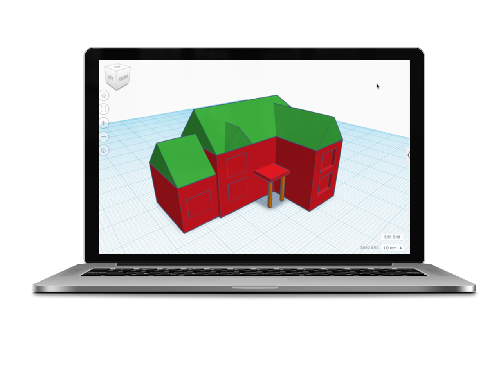

# Tinkercad

[Tinkercad](https://www.tinkercad.com) is a computer program used to create 3D models for computer games or printing.

## Learn

The following tutorials will help you learn how to use [Tinkercad](https://www.tinkercad.com).

1. Open [Tinkercad](https://www.tinkercad.com) and [sign up](tinkercad/tutorials/setup/register-and-login/#sign-up) for an account.
1. Open [Tinkercad](https://www.tinkercad.com) and [sign in](tinkercad/tutorials/setup/register-and-login/#sign-in)

### Beginner tutorials

1. [Create a house](tinkercad/tutorials/beginner/create-a-house.md)
1. [Create a keyring](tinkercad/tutorials/beginner/create-a-keyring.md)

### Intermediate Tutorials

1. [Create a car](tinkercad/tutorials/intermediate/create-a-car.md)
1. [Create a minion](tinkercad/tutorials/intermediate/create-a-minion.md)

## How-to

- [Add shapes](tinkercad/how-to/add-shapes.md)
- [Add text](tinkercad/how-to/add-text.md)
- [Align shapes](tinkercad/how-to/align-shapes.md)
- [Change font](tinkercad/how-to/change-font.md)
- [Copy and paste](tinkercad/how-to/copy-and-paste-shapes.md)
- [Group shapes](tinkercad/how-to/group-shapes.md)
- [Move shapes](tinkercad/how-to/move-shapes.md)
- [Move workplane](tinkercad/how-to/move-the-workplane.md)
- [Rotate and pan](tinkercad/how-to/rotate-and-pan.md)
- [Resize shapes](tinkercad/how-to/resize-shapes.md)
- [Select shapes](tinkercad/how-to/select-shapes.md)
- [Zoom in / out](tinkercad/how-to/zoom-in-and-out.md)
