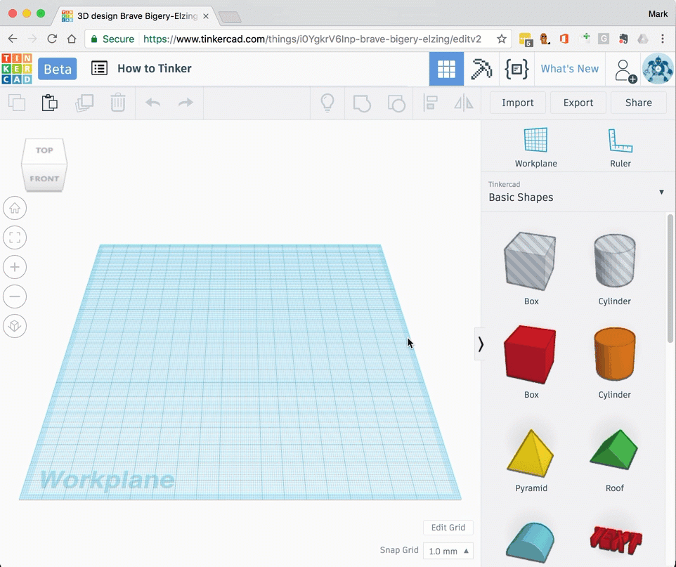

# Adding shapes

Many different shapes can be added to  your design.

1. Find the required shape in the **Basic shapes** menu.
1. Drag the shape from the menu to the workplane.
1. The shape will be positioned on the [workplane](move-the-workplane.md).

## Different shapes

- Basic shapes
    - Box
    - Cylinder
    - Roof
    - Wedge
    - Text

