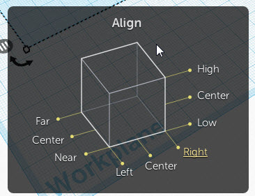

# Aligning shapes

When you have more than one shape in your workspace you might need to align them.

Shapes can be aligned in a number of different ways:

- Left to right
- Top to bottom
- Back to front
- etc

1. Add two shapes to your workplane.
1. Shift select both shapes.
1. Select the **Align** tool.

Helper controls will appear on each shape. These controls will help you to align your shapes

1. Select alignment guides on each shape to align your shapes in different ways.
1. Use the **undo** tool to step back to try different alignments.
