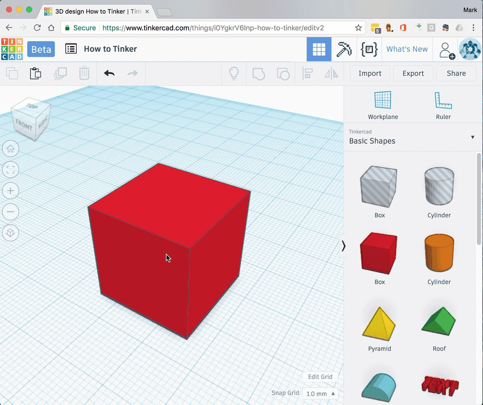

# Moving shapes

After dropping your shape on to the workplane you can move it to a different location using the move tool.

Shapes can be moved in a number of different directions:

- Left and right (x-axis)
- Forwards and backwards (y-axis)
- Up and down (z-axis)

## Arrow keys

1. [Add a shape](add-shapes.md) to your workplane.
1. Select the shape.
1. Use the arrow keys to move the shape
    1. Up / down arrow - to move the shape forwards and backwards.
    1. Left / right arrow - to move the shape left and right.
    1. CTRL + up/down arrow - to move the shape up and down.

## Click and drag

1. [Add a shape](add-shapes.md) to your workplane.
1. Select the shape.
1. Click and drag the shape.
1. Use the arrow handle to move the shape up and down.
1. Type a value into the dimension box if needed.

