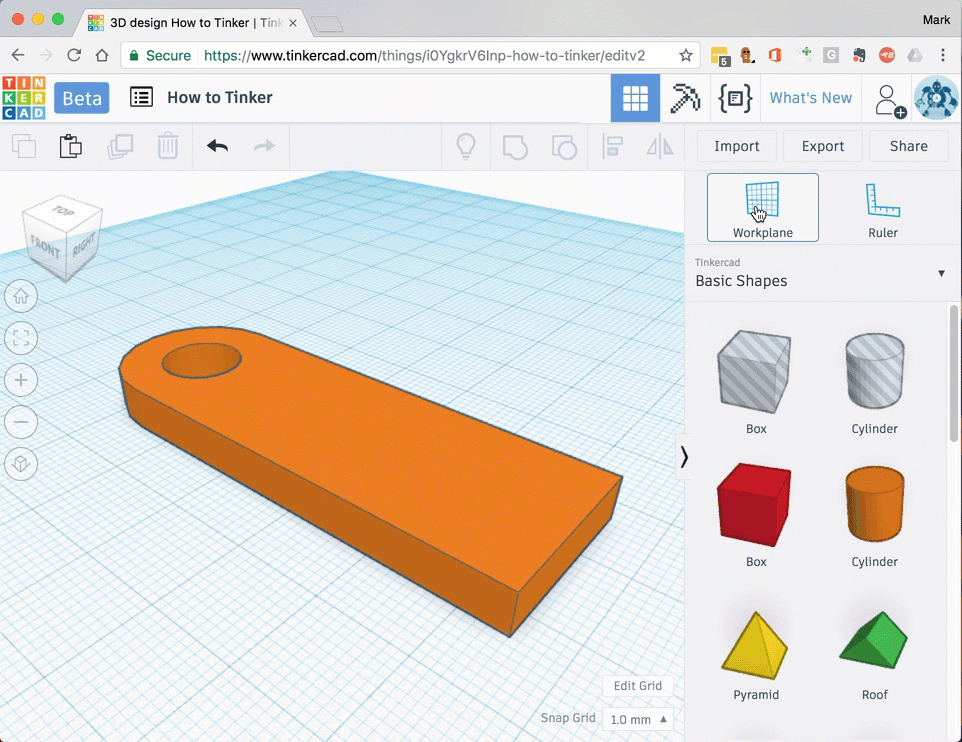

# Move the workplane

When you [add shapes](add-shapes.md) to your deisgn they will always be placed on the workplane.

If you want to place shapes somewhere different, you can move the work plane

1. Drag the workplance icon onto any surface on any shape - the workplane will be moved to match the face and change color. 

## Adding shapes to the workplane

1. Any new shapes will be *land* on the workplane.

