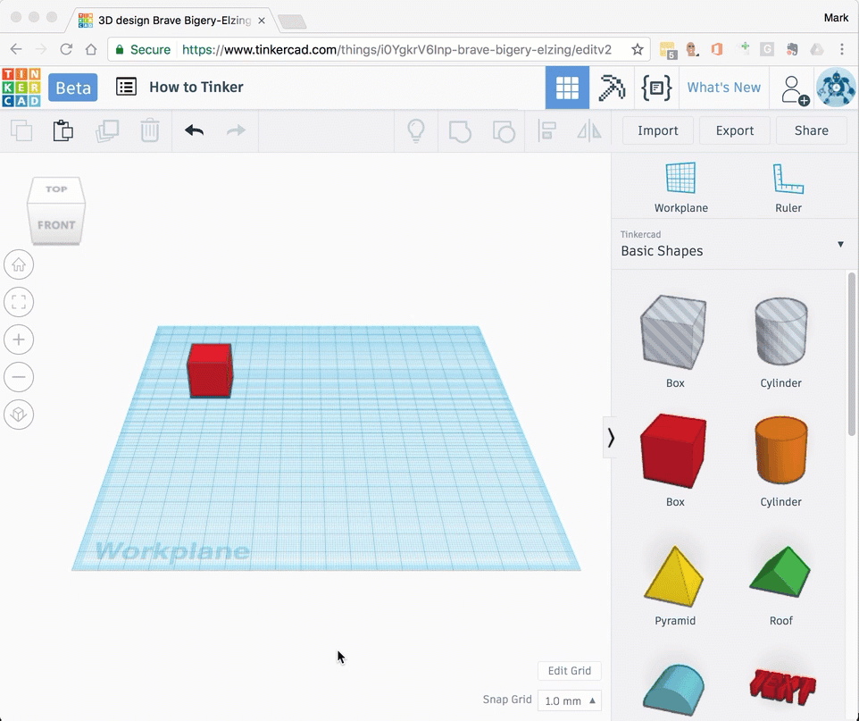

# Zooming in and out

When you want to change the size of your design in the view space you will need to *zoom in* or *zoom out*.

## Zoom in

When you want to view your design a bit closer you'll need to *zoom in*. When you zoom in you will see more details, but you might not see everything at once.

## Zoom out

When you want to view more of your design you'll need to *zoom out*. When you zoom out you will see less of your designs details, but you will see more design at one time. 

### Fit all in view

You can use the **Fit all in view** command to automatically zoom in or out to fit your whole model on the screen. 

