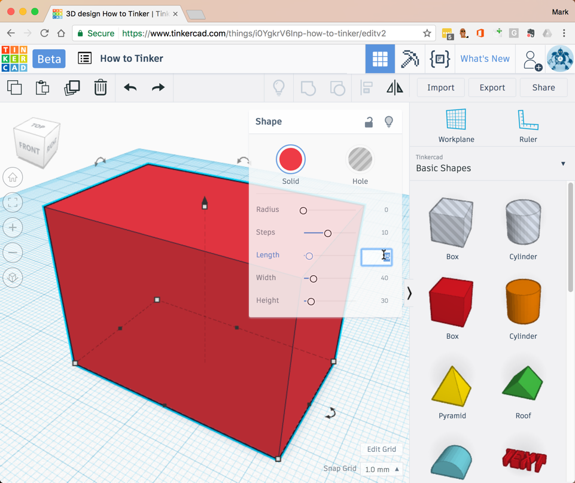
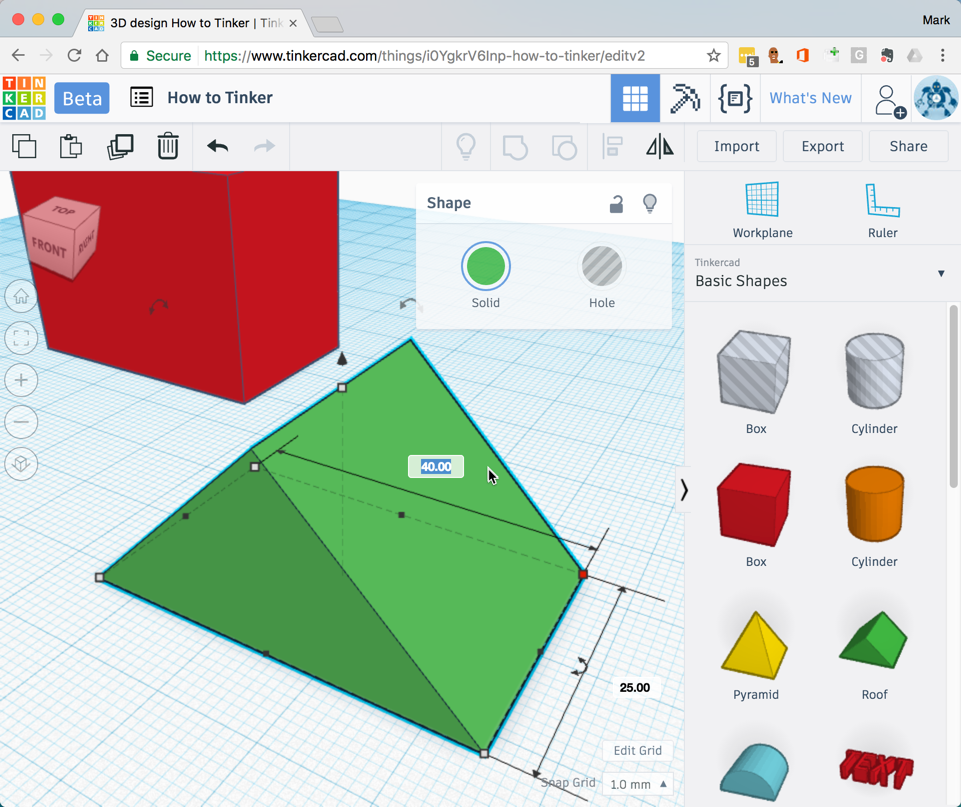
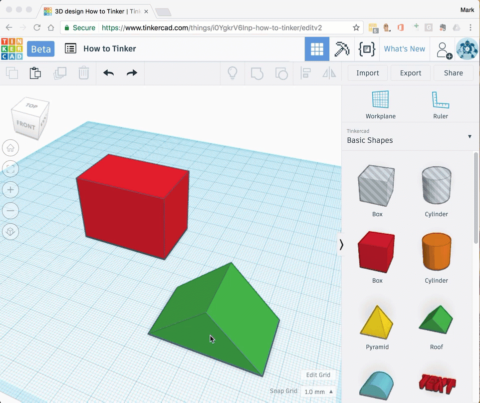
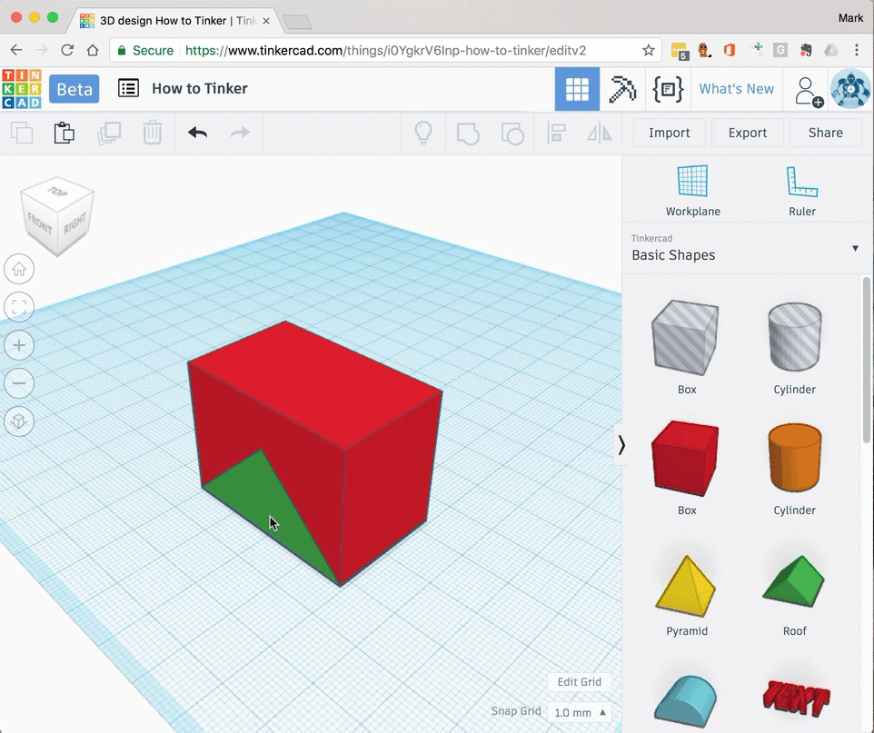
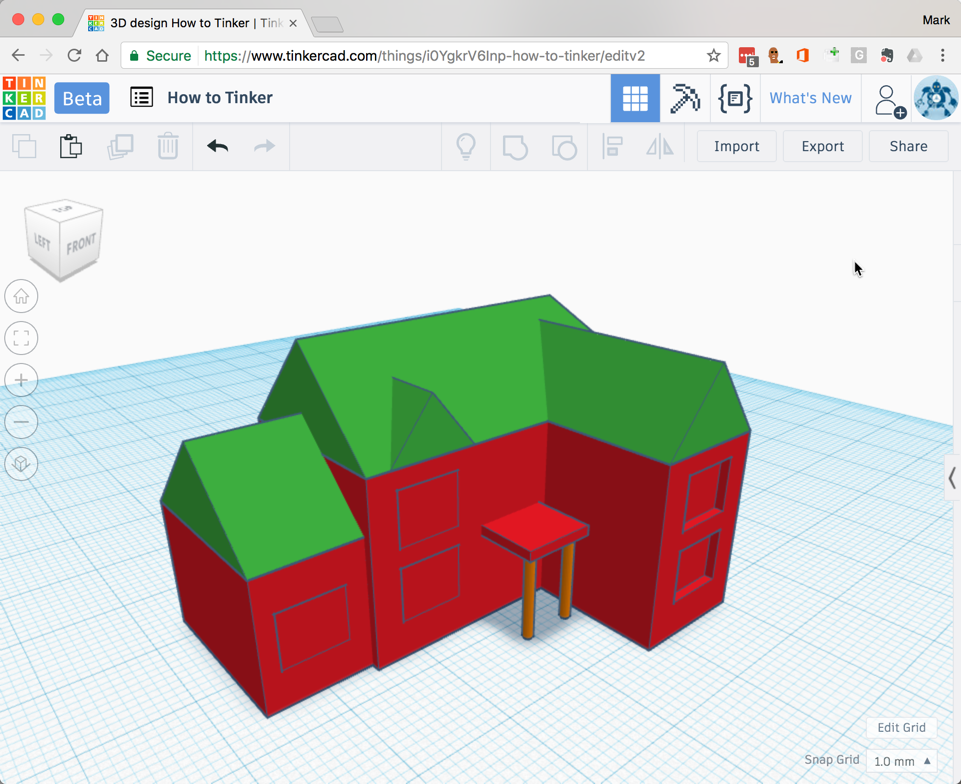

# Create a house

In this tutorial you will use simple shapes to create a 3D house.

## Login

Open the [Tinkercad](https://www.tinkercad.com) website and [sign-in](../setup/register-and-login/#sign-in)

## Add shapes

- [Add a **box**](../../how-to/add-shapes.md) anywhere on your workplane.
- [Resize](../../how-to/resize-shapes.md) the box to the following dimensions:
    - Length = `25mm`
    - Width = `40mm`
    - Height = `30mm`

    

- [Add a **roof**](../../how-to/add-shapes.md) anywhere on your workplane.
- [Resize](../../how-to/resize-shapes.md) the roof to the following dimensions:
    - Length = `25mm`
    - Width = `40mm`
    - Height = `20mm`

    

## Align shapes

- [Align](../../how-to/align-shapes.md) the front of the roof with the front of the box

    

- [Align](../../how-to/align-shapes.md) the center of the roof with the center of the box

    

## Move roof up

- Select the roof
- Using the top grab arrow [move](../../how-to/move-shapes.md) the roof up by `30mm`

    

Your model is starting to look like a house already :-)

## Add a door

- [Add a **box**](../../how-to/add-shapes.md) anywhere on your workplane.
- [Resize](../../how-to/resize-shapes.md) the box to the following dimensions:
    - Length = `2mm`
    - Width = `5mm`
    - Height = `10mm`
- [Move](../../how-to/move-shapes.md) the new box to the middle of the front wall. Make sure the door is *inside* the wall.
- On the shape menu, select the **Hole** option.
- [Select](../../how-to/select-shapes.md) both the wall and doors.
- [Group](../../how-to/group-shapes.md) the wall and door. Because the door is a *hole* it will be subtracted from the wall. 

## Get creative

Can you add your own windows, doors and to your house?

