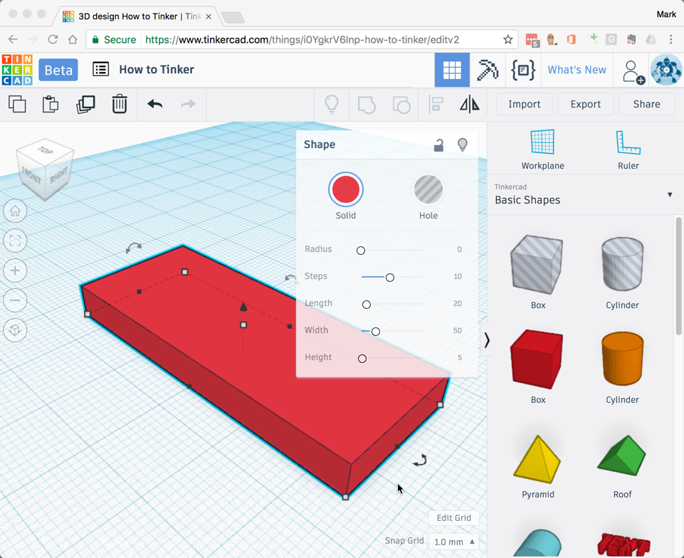
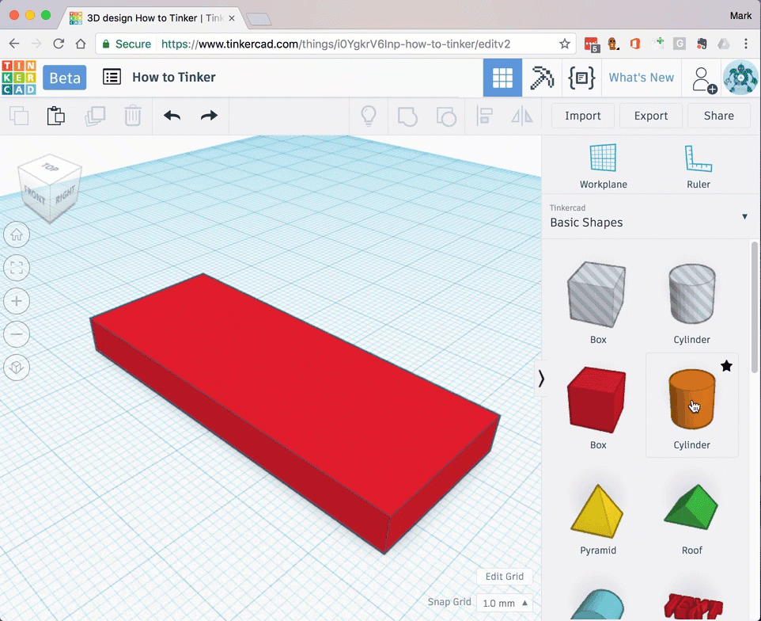
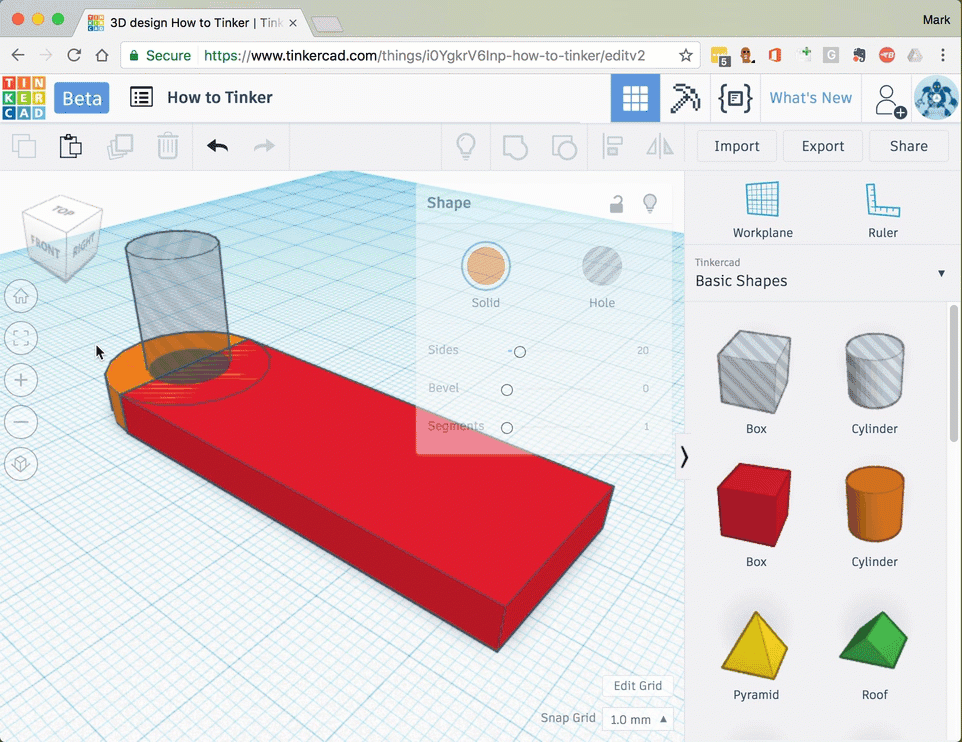

# Create a keyring

In this tutorial you will use simple shapes and text to create a personalised key ring.

## Login

Open the [Tinkercad](https://www.tinkercad.com) website and [sign-in](../setup/register-and-login/#sign-in)

## Create a simple key ring

- [Add a **box**](../../how-to/add-shapes.md) anywhere on your workplane.
- [Resize](../../how-to/resize-shapes.md) the box to the following dimensions:
    - Length = `20mm`
    - Width = `50mm`
    - Height = `5mm`

    

- [Add a **cylinder**](../../how-to/add-shapes.md) to the end of the box.
- [Resize](../../how-to/resize-shapes.md) the cylinder to `5mm` high.

    

- [Add another **cylinder**](../../how-to/add-shapes.md) to the end of the box.
- [Resize](../../how-to/resize-shapes.md) the cylinder to `10mm` along each side.
- [Align](../../how-to/align-shapes.md) the new cylinder to the centre of the first cylinder.
- Make the new cylinder a *hole*.

    

- [Group](../../how-to/group-shapes.md) the box and the first cylinder together to make a single shape.
- [Group](../../how-to/group-shapes.md) the new shape and the *hole* cylinder together to cut a hole through the first shape.

    

This is the simple starting point for all key rings

## Decorate your key ring

You can decorate your keyring with any shapes you choose. Here are some examples:

### :name_badge: with your name

You can add your name to the top of the keyring.

- [Move the workplane](../../how-to/move-the-workplane.md) so you can work on the top of your keyring.
- [Add a **text** shape](../../how-to/add-text.md) to your model and type in your name.
- [Resize the text](../../how-to/change-font.md) so it fits on the key ring top.

- View the keyring from on top.
- Reposition the text and [group](../../how-to/group-shapes.md) the keyring and the text.

Try different [fonts](../../how-to/change-font.md) and [sizes](../../how-to/resize-shapes.md) to find a design that you like.

### :stars: with some stars

You can add some other shapes to the top of the keyring.

- [Move the workplane]() so you can work on the top of your keyring.
- Find other shapes in the toolbox
- [Add a **star** shape]() to your model.

- [Resize](../../how-to/resize-shapes.md) the star so it fits on the key ring top.
- [Copy and paste] stars and change to the size and number of points. It's OK if the stars overlap - be creative!

- [Group](../../how-to/group-shapes.md) the key ring and the stars.

- Done! :tada:

## :paintbrush: Get creative! 

Can you come up with some creative ways to decorate your keyring?

- Cut your name out instead of adding it?
- Your favourite team or TV show?
